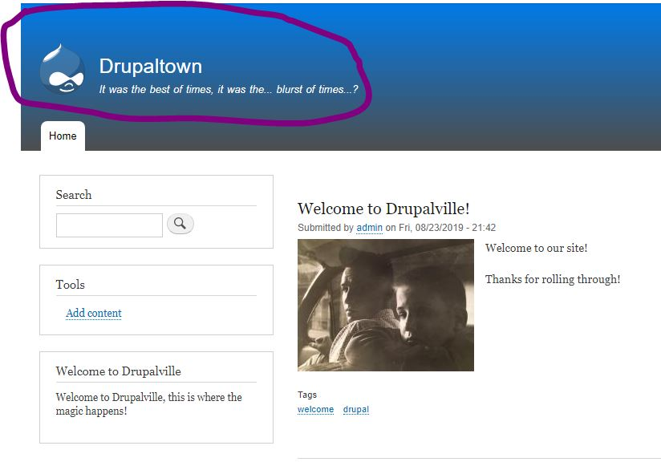
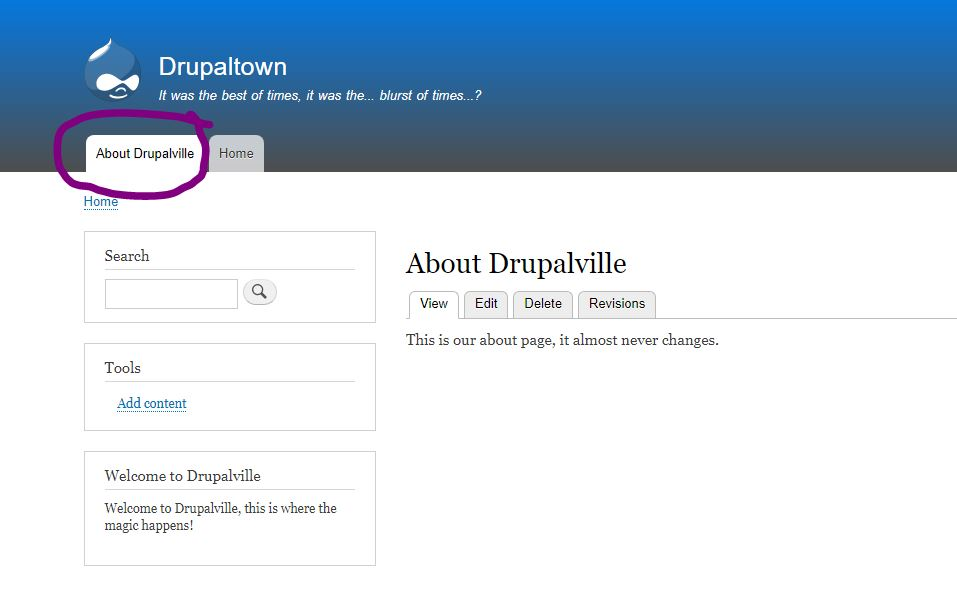
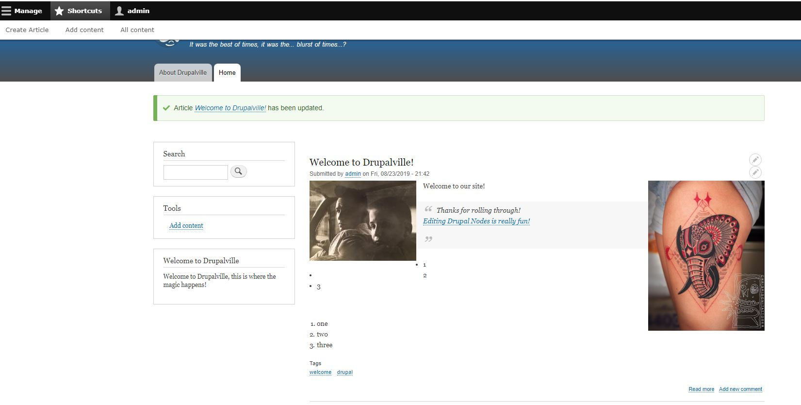

# Lesson 1: What is Drupal?

It is a CMS (Content-Management-System) which are typically preferred for large websites.

* It makes things such as updating a company logo that is on 1000's of pages in one fell-swoop.
* It is open-source

# Lesson 2: Why Drupal?

* Open-Source
* It's flexible
* It's mobile ready
* Good for big projects
* Friendly, social, searchable
* Safe and Secure

# Lesson 4: What You'll Need For This Course

Planning is crucial for Drupal, you really need to know what you are goin to build before diving in.

## Installation

Success!

# Lesson 8: Navigating a Fresh Installation

Touched on:
* Drupal Dashboard, inlcuding all menu shortucuts
    * Appearance

**NOTE:** All Drupal content items are called nodes

# Lesson 9: Drupal Content

* Created an article, and properly tagged it
    * This create my first Node!

# Lesson 10: Structure

This is where the majority of your site building is done

* Built a block and placed it on sidebar

# Lesson 11: Appearance

Shows all of the different themes for our site, you can custom manage things such as colors

**Changed toolbar colors*

# Lesson 12: Extend

Gives an overview of all modules on site

# Lesson 13: Configuration

Helps configure all aspects of site including text ediotr, and site information

* I updated basic site settings

# Lesson 14: People

* Create user-accounts
* Manage permissions

**I updated admin account!**

# Lesson 15: Reports

Useful for user metrics, logs, and additional status reports

# Lesson 16: Introduction to Content Types

Thi is where Drupal sets itself apart, in Drupal each item of content is called a node, and each node belongs to a single content type, which defines various default settings for nodes of that type.

* Views come in handy here
* Content types are a MAJOR advantage of Drupal

# Lesson 17: Creating an Article

This will be a more in-depth look at content types, we will create another article, but this time change more of it's settings.

# Lesson 18: Creating a Basic Page

Examine the differences between an article and a page.

* I added an about page, complete with a link

# Lesson 19: Inline Editing

Went over the various ways to edit page-content

* Quick-edit: For front-end changes
* Edit: Edit page for Node

# Lesson 20: Using CKEditor

Changed to Full HTML on Edit page and experimented with the different capabilities of this setting

# Key takeaways

* Drupal is like a framework
* Every "page" is a webform

# Source: Drupal 8 Beginner, by OSTraining

https://www.youtube.com/watch?v=GCW-upiPLqw&list=PLtaXuX0nEZk9MKY_ClWcPkGtOEGyLTyCO&index=2

